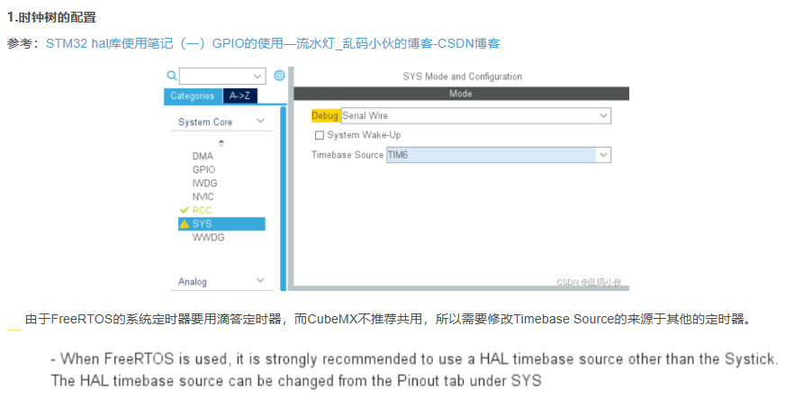

# 1.时钟树配置

​	由于FreeRTOS的系统定时器要用滴答定时器，而CubeMX不推荐共用，所以需要修改Timebase Source的来源于其他的定时器。

STM32F103RCT6中，TIM6~TIM7：无外部引脚与其相连，只有定时器功能。

# 2.FreeRTOS配置

## 2.1 配置动态内存空间
采用FreeRTOS动态内存分配，开发效率高，顾程序内存使用，多数采用动态内存分配方式，分配内存总空间为23K=23552byte。这里分配内存空间为40K，单位是byte，所以输入为40×1024=40960byte。heap：堆 1024