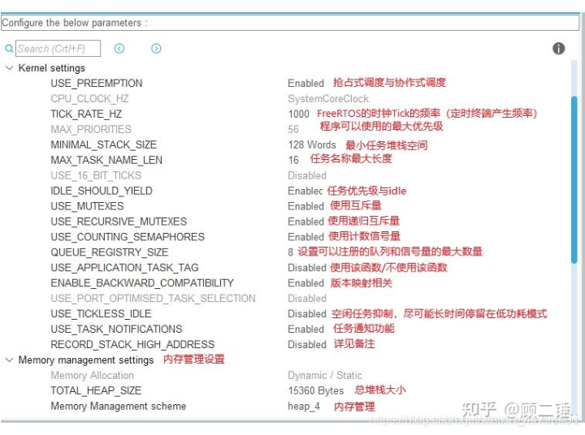

# 1.时钟树配置

​	由于FreeRTOS的系统定时器要用滴答定时器，而CubeMX不推荐共用，所以需要修改Timebase Source的来源于其他的定时器。

STM32F103RCT6中，TIM6~TIM7：无外部引脚与其相连，只有定时器功能。

# 2.FreeRTOS配置

## 2.1 配置动态内存空间

​	采用FreeRTOS动态内存分配，开发效率高，顾程序内存使用，多数采用动态内存分配方式，分配内存总空间为23K=23552byte。这里分配内存空间为40K，单位是byte，所以输入为40×1024=40960byte。heap：堆 1024

## 2.2 任务创建

## 2.3 队列

​	Queue Size是队列长度，Item Size是队列每个数据的大小

​	队列是为了任务与任务、任务与中断之间的通信而准备的，可以在任务与任务、任务与中 断之间传递消息，队列中可以存储有限的、大小固定的数据项目。任务与任务、任务与中断之 间要交流的数据保存在队列中，叫做队列项目。

​	队列所能保存的最大数据项目数量叫做队列的 长度，创建队列的时候会指定数据项目的大小和队列的长度。由于队列用来传递消息的，所以 也称为消息队列。FreeRTOS 中的信号量的也是依据队列实现的！所以有必要深入的了解 FreeRTOS 的队列。

​	写队列和读队列都是采用复制的方式，队列的操作都是采用先进先出的的方式（FIFO）

### 2.3.1 队列操作

#### 2.3.1.1 写队列

**在任务中使用又可以分为往后写入（常用）和往前写入**

**在中断中使用**

#### 2.3.1.2 读队列

**（被读取得队列中的数据会被去除，所以只能读一次，但是还有队列偷窥操作，可以多次读队列中的数据）**

 **队列偷窥（多次读队列中的地址）**

## 2.4 信号量

### 2.4.1信号量概念

### 2.4.2信号量分类

### 2.4.3二值信号量的基本操作

### 2.4.4计数信号量的基本操作

## 2.5 互斥量

​	低优先级的任务执行后高优先级任务才能执行，但是中优先级会插低优先级任务的队，等于是插了高优先级任务的队，把高优先级任务和低优先级任务绑定起来，让中优先级的任务等低优先级的任务，不会插到高优先级任务的队

### 2.5.1 互斥量的基本操作

## 2.6 事件组

## 2.7 任务通知

## 2.8 软件计时器

## 2.9 中断

## 2.10 Config parameters各项详解

<table><thead><tr><th>参数名称</th><th>参数说明</th></tr></thead><tbody><tr><td>USE_PREEMPTION</td><td>定义调度器模式，抢占式</td></tr><tr><td>TICK_RATE_HZ</td><td>定义CPU主频，单位Hz。这个就是1ms</td></tr><tr><td>MAX_PRIORITIES</td><td>定义可供用户使用的最大优先级数</td></tr><tr><td>MINIMAL_STACK_SIZE</td><td>定义空闲任务的栈空间大小，单位字不是byte</td></tr><tr><td>MAX_TASK_NAME_LEN</td><td>定义任务名最大字节数</td></tr><tr><td>USE_16_BIT_TICKS</td><td>根据这个值的不同，系统时钟节拍计数TickType_t数据类型不同</td></tr><tr><td>IDLE_SHOULD_YIELD</td><td>使能与空闲任务同优先级的任务</td></tr><tr><td>USE_MUTEXES</td><td>使能互斥锁</td></tr><tr><td>USE_RECURSIVE_MUTEXES</td><td>使能递归互斥锁</td></tr><tr><td>USE_COUNTING_SEMAPHORES</td><td>使能计数信号量</td></tr><tr><td>QUEUE_REGISTRY_SIZE</td><td>设置可以注册的信号量和消息队列的个数</td></tr><tr><td>USE_APPLICATION_TASK_TAG</td><td>使能任务标记</td></tr><tr><td>ENABLE_BACKWARD_COMPATIBILITY</td><td>使能新版本对老版本的兼容特性</td></tr><tr><td>USE_PORT_OPTIMISED_TASK_SELECTION</td><td>此配置用于优化优先级列表中要执行的最高优先级任务的算法（也就是用于查找下一个要运行任务的方法）</td></tr><tr><td>USE_TICKLESS_IDLE</td><td>配置用于使能tickless低功耗模式</td></tr><tr><td>USE_TASK_NOTIFICATIONS</td><td>使能任务间直接的消息传递，包括信号量，事件标志组和消息邮箱</td></tr></tbody></table>

## 2.11 **FreeRTOS Heap Usage 堆使用情况：**

## 2.12 Include parameters 函数使能：

# 3. FreeRTOS基础知识

## 3.1 任务创建函数（与任务函数主体区分，任务函数主体是任务创建函数的一个参数）
​	任务的栈， 任务的函数实体， 任务的控制块最终需要联系起来才能由系统进行统一调度。那么这个联系的工作就由任务创建函数 xTaskCreateStatic()来实现，该函数在 task.c（task.c 第一次使用需要自行在文件夹 freertos 中新建并添加到工程的 freertos/source 组）中定义， 在 task.h 中声明， 所有跟任务相关的函数都在这个文件定义。

## 3.2 FreeRTOS任务执行原则

​	默认情况下：使用时间片抢占式任务调度，但是还有一种合作式任务调度，但是不太用

### 3.2.1 合作式任务调度

### 3.2.2 抢占式任务调度

**注意：永远优先执行优先级最高的任务**

## 3.3 FreeRTOS任务的状态

​	freeRTOS任务的状态有四种：运行、就绪、阻塞、挂起
<ul><li>运行态（runnnig）：当任务正在运行，此时的状态被称为运行态，即CPU的使用权被这个任务占用；</li><li>挂起态（暂停状态）（suspended）：任务被暂时停止，通过调用挂起函数（vTaskSuspend()）可以把指定任务挂起，任务挂起后暂时不会运行，只有调用恢复函数（xTaskResume()）才可以退出挂起状态；</li><li>阻塞态（blocked）：任务在等待信号量、消息队列、事件标准组、系统延时时，被称为阻塞态，如果等待的事件到了，就会自动退出阻塞态，准备运行；</li><li>就绪态（ready）：任务已经具备了运行条件（没有被挂起或阻塞），但是又更高优先级或同优先级的任务正在运行，所以需要等待的状态。</li></ul>

**注意：任务创建后，默认是最高优先级的先执行，如果俩个任务同优先级，后创建的任务先执行**

